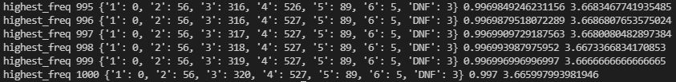
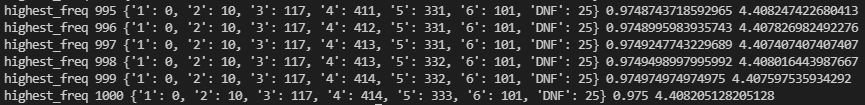

# wordle-ai
This AI currently has an accuracy of approximately 99.7% and an average steps-per-game of 3.67 using the answer list (2315 words)-
 

 
In the image above, the number of guesses it took to guess the word is shown in a dictionary (1: 0, 2: 300...).
The numbers following the dictionary is the accuracy (percent of games completed) and the average steps per completed game, respectively.
 
Using the full allowed words list (12947 words), the AI has an accuracy of approximately 97.5% and an average steps-per-game of 4.41-
 

 
 
# How it Works
The AI makes the same first guess every game- "salet". This word is statistically one of the best words to pick.
  
Subsequent guesses are made by filtering the list of possible words by removing the words that include letters that have already been guessed and selecting the remaining word with the greatest word score. The word score is given by the sum of each letter's frequency in the list of possible answers, not including repeated letters within the word. If there is a case where a list is between 2 and 10 words and at least half of the words (rounded down) have at least 3 of the same letters in common, the AI will look at the full list and guess a word with the highest word score that excludes the letters in common (this is also referred to as a "blimp search" in the code). After a guess is made, the list of possible words is filtered based on the letters that are in the word and the letters that are in the correct position. The words that contain letters that are not in the word are removed.
  
In the code, there is a multithreading-compatible method of another heuristic used, which iterates through the entire possible word list for each word and returns the weighted average of how much the list would be reduced if a certain word was the answer. Given that this search had a O(n^2) complexity, multithreading was used to speed things up. However, the speed at which it completes a game is still slower than practical. With our limited tests, it is plausible that the deep search algorithm is more efficient in the number of attempts, but not many trials have been run due to its cumbersome speed.
  
A webdriver was also created using Selenium, which allows the user to open up wordle directly through the code and watch the AI play through the game.
