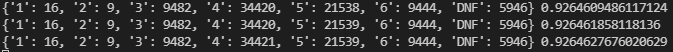

# wordle-ai
This AI currently has an accuracy of approximately 93%-
 

 
In the image above, the number of guesses it took to guess the word is shown in a dictionary (1: 16, 2: 9...).
 
 
# How it Works
The AI makes the same first two guesses every game- "stand" and "oiler." These words have the highest "word score" based on the list of words this program uses, which is explained in more detail later.
  
Subsequent guesses are made by filtering the list of possible words by removing the words that include letters that have already been guessed and selecting the remaining word with the greatest word score. Once the number of possible words is fewer than the number of guesses left, a random word is selected from the list until the correct word is submitted.
  
After a guess is made, the list of possible words is filtered based on the letters that are in the word and the letters that are in the correct position. The words that contain letters that are not in the word are removed.
